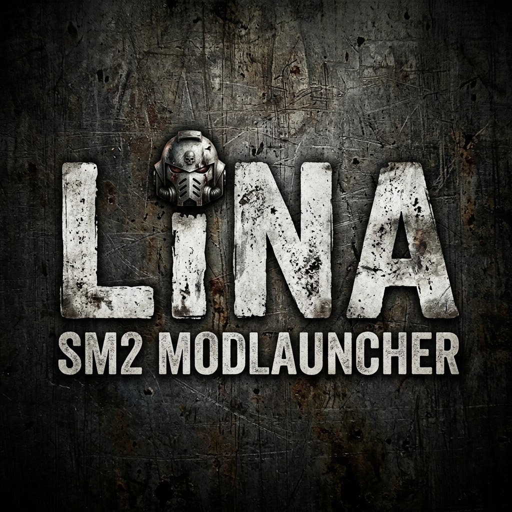

<p align="center">
  
</p>

# LiNa SM2 - Mod Launcher

A mod launcher for **Warhammer 40,000: Space Marine 2** on Linux — Steam,
Proton, and a savegame directory that Steam Cloud can overwrite at any
moment. "LiNa" is short for *Linux native*.

It manages the mod load order, keeps profiles of it, makes verified
backups of your savegames before anything touches them, and starts the
game with or without mods and with or without EAC.


## Install

```sh
curl -fsSL https://raw.githubusercontent.com/Carlos17Kopra/linasm2-modloader/main/install.sh | sh
```

No root, no package manager. It puts the launcher, its menu entry and its
icon under your home directory and nothing else:

| File | Purpose |
| --- | --- |
| `~/.local/bin/lina-sm2` | the launcher itself (GUI and CLI in one binary) |
| `~/.local/share/applications/lina-sm2.desktop` | entry in the application menu |
| `~/.local/share/icons/hicolor/<size>/apps/lina-sm2.png` | its icon, in four sizes |

The released binary is checked against the `SHA256SUMS` of the same
release before anything is unpacked; a mismatch stops the installation and
leaves an existing one untouched.

Running the same line again updates an existing installation, and says so
and stops if there is nothing newer to install.

> Piping a script from the internet into a shell means trusting whoever
> controls that URL. The script is short and does nothing clever — if you
> would rather read it first:
> `curl -fsSL .../install.sh -o install.sh && less install.sh && sh install.sh`

### Options

```sh
sh install.sh --version 0.2.0   # install a specific release
sh install.sh --force           # reinstall, or go back to an older release
sh install.sh --uninstall       # remove the three files above
```

`--uninstall` keeps your settings, profiles and savegame backups
(`~/.config/lina-sm2`, `~/.local/share/lina-sm2`). Delete those by hand if
you really want them gone.

### If `lina-sm2` is not found afterwards

`~/.local/bin` is not on your `PATH`. The application menu entry works
regardless, because it points at the absolute path. To use the name in a
shell, add this to `~/.bashrc` or `~/.zshrc`:

```sh
export PATH="$HOME/.local/bin:$PATH"
```

The installer deliberately does not edit those files for you.

## Install on Windows

There is no installer and no one-liner. Download
`lina-sm2-<version>-x86_64-windows.zip` from the
[releases](https://github.com/Carlos17Kopra/linasm2-modloader/releases),
unpack it anywhere and run `lina-sm2.exe`. To uninstall, delete the
folder; settings and backups under `%APPDATA%\lina-sm2` and
`%LOCALAPPDATA%\lina-sm2` stay until you delete those too.

Two things to expect, both explained in the `README.txt` inside the ZIP:
Windows shows a SmartScreen warning because the executable is not signed,
and a console window opens next to the launcher because the same file is
both the graphical and the command line tool.

> **The Windows build is untested.** It compiles in CI and its logic is
> covered by tests, but no one has yet run it on a machine that actually
> has Space Marine 2 installed — game detection, the savegame paths and
> starting the game are unverified there. Reports welcome.

## Requirements

- x86_64 — the same architecture Proton needs. Linux, or Windows 10/11
- Space Marine 2 installed through Steam, and **started at least once** on
  Linux, so that its Proton prefix exists
- On Linux, `curl` or `wget` and `tar` — present on every desktop distribution

## Build from source

Needs Rust 1.95 or newer (`rustup`; almost no distribution ships it yet):

```sh
git clone https://github.com/Carlos17Kopra/linasm2-modloader.git
cd linasm2-modloader
cargo build --release      # target/release/lina-sm2
cargo test                 # the full suite, including the installer's
```

## Usage

Started without arguments it opens the graphical interface. With
arguments the very same binary is a command line tool:

```sh
lina-sm2 list              # every mod in load order
lina-sm2 enable <mod.pak>
lina-sm2 order a.pak b.pak # set the load order
lina-sm2 save backup       # back up the savegames
lina-sm2 play              # start the game with the current mods
lina-sm2 paths             # what was detected where
lina-sm2 --help
```

English and German are both built in; `lina-sm2 lang de` switches, and the
graphical interface has the same choice in its settings.

## The interface

A profile is the load order plus which mods were on, under a name. Saving
one takes the current state; applying one puts it back, and says which
mods a profile knows but that are no longer installed. A launch without
mods writes one by itself beforehand, marked *automatic* — it is the way
back to the selection that launch just switched off.


Every backup carries a manifest with a hash for each file it holds.
*Verify* reads the archive back and compares them, so a backup is known to
be good before it is ever needed. Restoring backs the current state up
first — that is not a setting and cannot be turned off.


The directories are detected, not configured: the Steam library, the
Proton prefix the savegames live in, and the `pak_config.yaml` the load
order is written to. Only the game directory can be set by hand, for an
installation Steam does not report.


## License

MIT — see [LICENSE](LICENSE).
